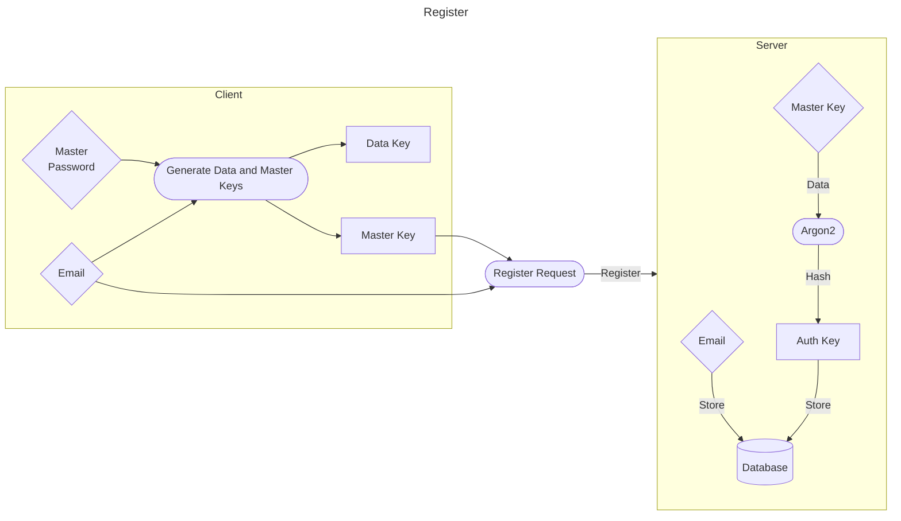
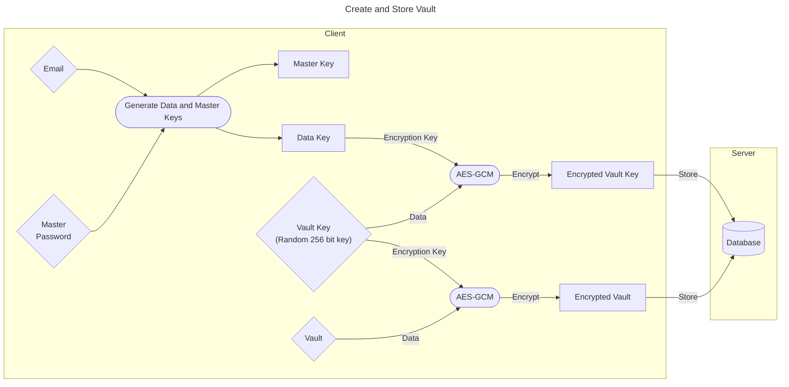
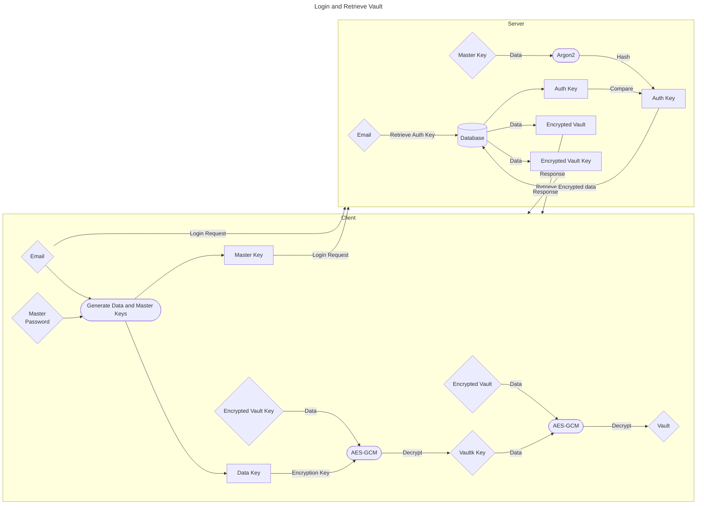

# !!! WARNING !!!
This password manager is not secure yet, and should not be used to store sensitive information.
# A Simple CLI Password Manager

This is a simple CLI password manager written in Python.
Run a server on a machine, access it from another machine through the client using a master password.
Store your passwords in an encrypted vault, and send them back to the server for storage.

## Requirements
- Python 3.11 or higher
- WSL (Windows Subsystem for Linux) if you are running Windows
- Git

If you want to use SSL, you need to have a certificate and key file, or openssl installed.

## Installation
```bash
git clone https://github.com/lassejep/ljk.git
cd ljk
pip install -r requirements.txt
python -m unittest
```
Make sure all tests pass before running the server and client.

If you are having trouble with the `cryptography` package, try running the following command:
```bash
sudo apt-get install build-essential libssl-dev libffi-dev python3-dev cargo pkg-config
```

## Setup
### SSL
If you want SSL enabled, and you don't have a certificate and key file, you can generate them with openssl using the following command.
```bash
openssl req -new -newkey rsa:2048 -days 365 -nodes -x509 -keyout server.key -out server.crt
cat server.crt server.key > server.pem
```
Then simply fill out the information asked for.


This will generate a certificate and key file, and combine them into a single file.
When running the server you can use the `server.pem` file as the certificate.
Note that this is a self-signed certificate, and the private key is not protected by a password.
If you want to protect the private key with a password, you can remove the `-nodes` flag from the command above.

If you still have trouble with SSL, try adding the following line to the end of the openssl command.
```bash
--addext "subjectAltName = IP:<ip>"
```

### Server
Run the server on a machine that you want to store your user database on and connect to from the client.
```bash
python server.py
```
This will generate a `server.conf` file where you can configure the server.
It will also start the server on the default host and port, which you can change in the `server.conf` file.

### Client
Run the client on a machine that you want to access your user database from.
```bash
python client.py
```
First time you run the client a `client.conf` file will be generated where you can configure the client.
It will also try to connect to the server on the default host and port, which you can change in the `client.conf` file.

Once you have the client and server running, you can register a new user, login, and store and retrieve passwords.

## Planned Features
### High Priority
- [ ] GPG integration
- [ ] Expanded password generation options
- [ ] UI improvements
- [ ] File encryption and storage
- [ ] Better error handling

### Low Priority
- [ ] Better windows support
- [ ] Mobile app
- [ ] Browser extension

## How it works







