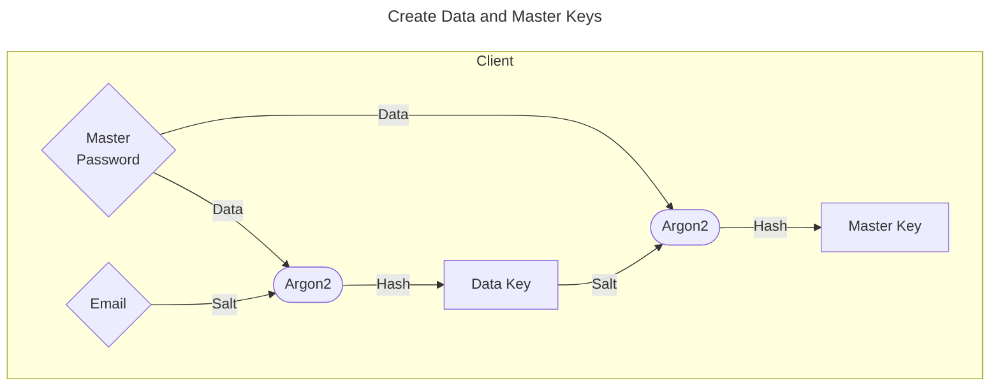

# A Simple CLI Password Manager
This is a simple CLI password manager written in Python.
Run a server on a machine, access it from another machine through the client using a master password.
Store your passwords in an encrypted vault, and send them back to the server for storage.

## Requirements
- Python 3.6 or later
- Linux

## Installation
```bash
git clone https://github.com/lassejep/ljk.git
cd ljk
pip install -r requirements.txt
python -m unittest
```
Make sure all tests pass before running the server and client.

## Usage
### Server
Run the server on a machine that you want to store your user database on.
```bash
python server.py --host <ip> -p <port> -d <database name> -l <log directory> -s <path to ssl certificate>
```
### Client
Run the client on a machine that you want to access your user database from.
```bash
python client.py --host <ip> -p <port> -s <path to ssl certificate>
```

## How it works



